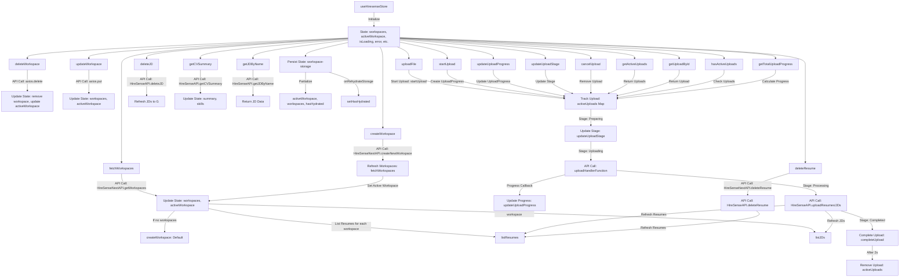

# `Hiresense` Store using Zustand

```mermaid
graph TD
    A[useHiresenseStore] -->|Initialize| B[State: workspaces, activeWorkspace, isLoading, error, etc.]

    %% Workspace Actions
    B --> C[fetchWorkspaces]
    C -->|API Call: HireSenseNextAPI.getWorkspaces| D[Update State: workspaces, activeWorkspace]
    D -->|If no workspaces| E[createWorkspace: Default]
    D -->|List Resumes for each workspace| F[listResumes]
    D -->|List JDs for each workspace| G[listJDs]

    B --> H[createWorkspace]
    H -->|API Call: HireSenseNextAPI.createNewWorkspace| I[Refresh Workspaces: fetchWorkspaces]
    I -->|Set Active Workspace| D

    B --> J[deleteWorkspace]
    J -->|API Call: axios.delete| K[Update State: remove workspace, update activeWorkspace]

    B --> L[updateWorkspace]
    L -->|API Call: axios.put| M[Update State: workspaces, activeWorkspace]

    %% File Upload Actions
    B --> N[uploadFile]
    N -->|Start Upload: startUpload| O[Track Upload: activeUploads Map]
    O -->|Stage: Preparing| P[Update Stage: updateUploadStage]
    P -->|Stage: Uploading| Q[API Call: uploadHandlerFunction]
    Q -->|Progress Callback| R[Update Progress: updateUploadProgress]
    Q -->|Stage: Processing| S[API Call: HireSenseAPI.uploadResumes/JDs]
    S -->|Refresh Resumes| F
    S -->|Refresh JDs| G
    S -->|Stage: Completed| T[Complete Upload: completeUpload]
    T -->|After 2s| U[Remove Upload: activeUploads]

    %% Resume and JD Management
    B --> V[deleteResume]
    V -->|API Call: HireSenseNextAPI.deleteResume| W[API Call: HireSenseAPI.deleteResume]
    W -->|Refresh Resumes| F

    B --> X[deleteJD]
    X -->|API Call: HireSenseAPI.deleteJD| Y[Refresh JDs to G]

    B --> Z[getCVSummary]
    Z -->|API Call: HireSenseAPI.getCVSummary| AA[Update State: summary, skills]

    B --> AB[getJDByName]
    AB -->|API Call: HireSenseAPI.getJDByName| AC[Return JD Data]

    %% Upload Progress Management
    B --> AD[startUpload]
    AD -->|Create UploadProgress| O

    B --> AE[updateUploadProgress]
    AE -->|Update UploadProgress| O

    B --> AF[updateUploadStage]
    AF -->|Update Stage| O

    B --> AG[cancelUpload]
    AG -->|Remove Upload| O

    B --> AH[getActiveUploads]
    AH -->|Return Uploads| O

    B --> AI[getUploadById]
    AI -->|Return Upload| O

    B --> AJ[hasActiveUploads]
    AJ -->|Check Uploads| O

    B --> AK[getTotalUploadProgress]
    AK -->|Calculate Progress| O

    %% State Persistence
    B --> AL[Persist State: workspace-storage]
    AL -->|Partialize| AM[activeWorkspace, workspaces, hasHydrated]
    AL -->|onRehydrateStorage| AN[setHasHydrated]
```

# Axios API CAlls

```mermaid
graph TD
    A[Client] -->|API Requests| B[HireSenseAPI: Flask Backend]
    A -->|API Requests| C[HireSenseNextAPI: Next.js Backend]

    %% Flask Backend (HireSenseAPI)
    B -->|POST /upload/resume| D[uploadResumes: Upload resume files]
    D -->|Input: file_paths, workspace_name| E[Return: UploadResponse]
    E -->|Success| A

    B -->|POST /resume/list| F[listResumes: List resumes in workspace]
    F -->|Input: workspace_name| G[Return: ListResumeResponse]
    G -->|Success| A

    B -->|POST /jd/list| H[listJDs: List JDs in workspace]
    H -->|Input: workspace_name| I[Return: ListJDResponse]
    I -->|Success| A

    B -->|DELETE /delete/resume/guestId/workspaceName/resume_file_name| J[deleteResume: Delete a resume]
    J -->|Input: resume_file_name, workspaceName| K[Return: Success Response]
    K -->|Success| A

    B -->|DELETE /delete/jd/guestId/workspaceName/jd_file_name| L[deleteJD: Delete a JD]
    L -->|Input: jd_file_name, workspaceName| M[Return: Success Response]
    M -->|Success| A

    B -->|POST /upload/jd| N[uploadJobDescriptions: Upload JD files]
    N -->|Input: jd_files, workspace_name| O[Return: UploadResponse]
    O -->|Success| A

    B -->|POST /jd/shortlist| P[jdShortListing: Shortlist JDs]
    P -->|Input: file_paths, workspace_name| Q[Return: JDShortlistingResponse]
    Q -->|Success| A

    B -->|POST /chat| R[sendChatMessage: Send chat message]
    R -->|Input: message, jd_search, workspace_name| S[Return: ChatResponse]
    S -->|Success| A

    B -->|POST /chat/keyword| T[sendKeywordChat: Send keyword-based chat]
    T -->|Input: keyword| U[Return: ChatResponse]
    U -->|Success| A

    B -->|POST /resume/summary| V[getCVSummary: Get CV summary]
    V -->|Input: file_path, workspace_name| W[Return: SummaryResponse]
    W -->|Success| A

    B -->|POST /jd/by-name| X[getJDByName: Get JD by name]
    X -->|Input: workspace_name, jd_file| Y[Return: JDByNameResponse]
    Y -->|Success| A

    %% Next.js Backend (HireSenseNextAPI)
    C -->|POST /upload/resume| Z[uploadResumeFiles: Upload resume files]
    Z -->|Input: files, workspaceName, onProgress| AA[Return: UploadResponse]
    AA -->|Success| A

    C -->|POST /upload/jd| AB[uploadJobDescriptionFiles: Upload JD files]
    AB -->|Input: files, workspaceName, onProgress| AC[Return: UploadResponse]
    AC -->|Success| A

    C -->|DELETE /resume| AD[deleteResume: Delete a resume]
    AD -->|Input: resume_file_name, workspaceName| AE[Return: Success Response]
    AE -->|Success| A

    C -->|DELETE /jd| AF[deleteJD: Delete a JD]
    AF -->|Input: jd_file_name, workspaceName| AG[Return: Success Response]
    AG -->|Success| A

    C -->|GET /workspace| AH[getWorkspaces: Fetch all workspaces]
    AH -->|No Input| AI[Return: Workspace Array]
    AI -->|Success| A

    C -->|POST /workspace/name| AJ[createNewWorkspace: Create a workspace]
    AJ -->|Input: workspace| AK[Return: createWorkspaceResponse]
    AK -->|Success| A

    C -->|POST /workspace/default| AL[createDefaultWorkspace: Create default workspace]
    AL -->|No Input| AM[Return: Workspace]
    AM -->|Success| A

    %% Error Handling
    B -->|Error| AN[handleApiError: Process errors]
    C -->|Error| AN
    AN -->|Error Response| A
```
